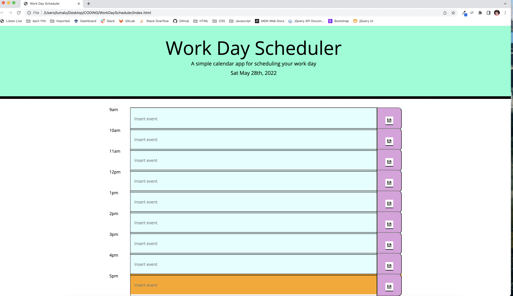
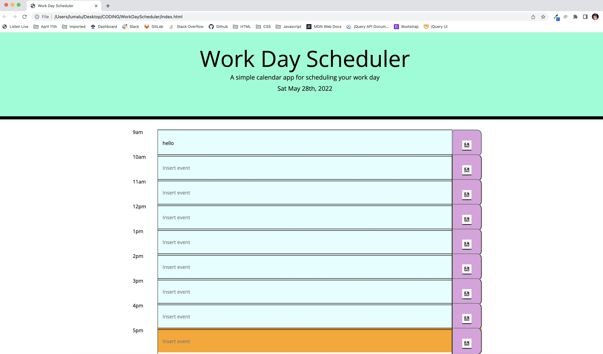

# WorkDayScheduler

A dynamic schedule that saves text inputs and also color codes the time depending on if the planner event is in the past, present or future as indicated by the colors: cyan, orange and green.

Deployment link:

Screen shots:

